# Ownership / Flow Analysis Final Exam

Core question:

"Given this subject, can we explain:
1. where it originated,
2. how it moved,
3. who can access it,
4. who can mutate it,
5. when it dies?"

---

## 1. IDENTITY

What is this thing?
This is the "who am I?" layer.

Examples:
```rust
let x = 1;
```
`x` is:
- identifier
- local binding
- i32 value
- stack location

Concepts:

- Declaration
- Identifier
- Symbol
- Binding
- Shadowing
- Alias identity
- Memory identity

Questions:

"Are these two names the same thing?"
```rust
let x = 1;
let y = x;
```

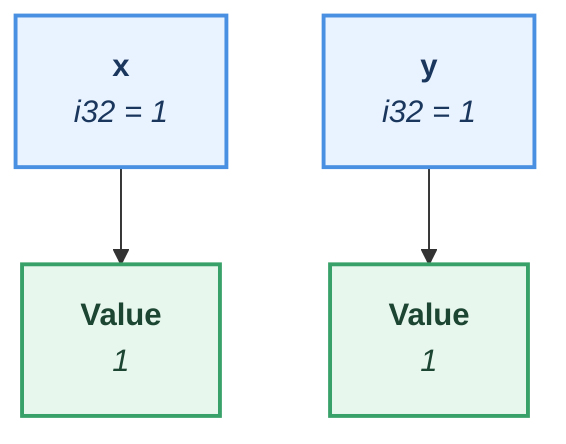
<div align="center">
Figure ... — Independent bindings with identical values
</div>

---
## 2. ALLOCATION

Where does the memory come from?

Stack:

```rust
let x = 1;
```

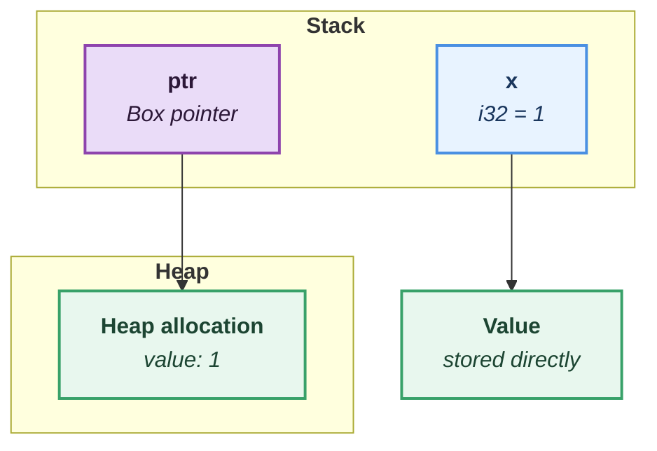
<div align="center">
Figure
</div>

Concepts:

- Stack allocation
- Heap allocation
- Box
- Vec
- String
- Rc allocation
- Arc allocation
- Static memory

Questions:

"Where is the actual data?"

---
## 3. VALUE CREATION

How did this value come into existence?


Sources:

Literal:
```rust
let x = 5;
```
Copy:
```rust
let y = x;
```
Move:
```rust
let y = String::new();
```
Clone:
```rust
let y = x.clone();
```
Function return:
```rust
let x = foo();
```
Struct:
```rust
let x = MyStruct {};
```
Enum:
```rust
let x = Some(value);
```


Questions:

"What is the origin node?"

---

## 4. FLOW / TRANSFER

How did identity travel?

This section tracks how a value moves from one binding to another.

Important distinction:
- Data flow: a value was used to produce another value.
- Move: ownership transferred.
- Borrow: access was temporarily granted.
- Clone: a new handle/value relationship was created.

---

### Value flow

Example:
```rust
let a = String::from("hello");
let b = transform(a);
```
Question:
"What value did b come from?"

This is a dependency relationship.
It does not necessarily mean the same memory exists.

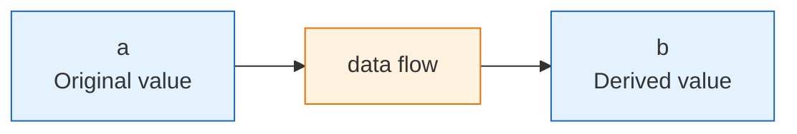
<div align="center">
Figure
</div>

###  Ownership transfer

Example:
```rust
let s1 = String::from("hello");
let s2 = s1;
```

Question:
"Who owns the allocation now?"

The allocation did not move.
The ownership binding moved.


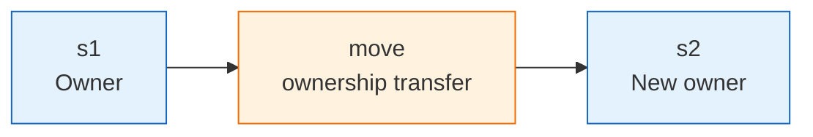


###  Borrow flow

Example:
let x = String::from("hello");
let y = &x;

Question:
"Who temporarily has access?"

Ownership stays with x.
y is only a reference.

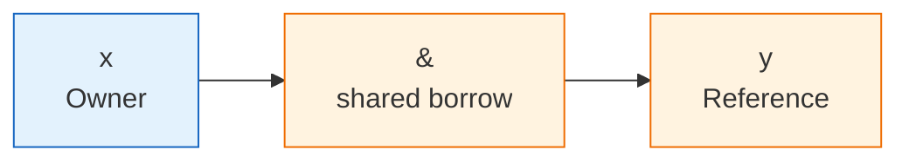
<div align="center">
Figure
</div>
###  Mutable borrow flow

Example:
let mut x = 1;
let y = &mut x;

Question:
"Who temporarily controls mutation?"

Only one mutable reference may exist at a time.
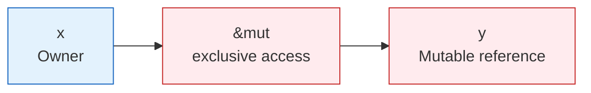

###  Clone flow
Example:
```rust
let x = Arc::new(value);
let y = x.clone();
```
Question:
"Did we copy the value, or copy access to the value?"

Arc clone creates another owner handle.
The underlying allocation is shared.

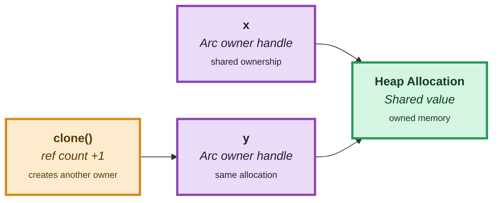
<div align="center">
Figure
</div>
### Summary
#### Data Flow

"b depends on a"

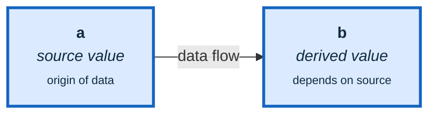

---

#### Move

"ownership changed"

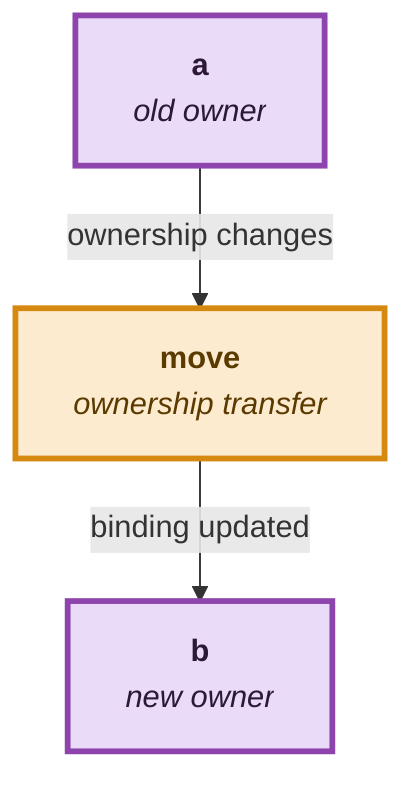
<div align="center">
Figure
</div>
---

#### Borrow

"temporary access"

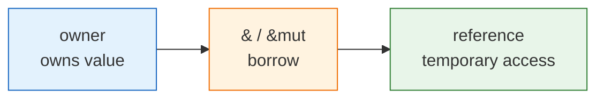

---

#### Clone

"new handle, shared value"

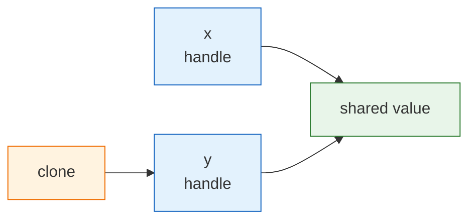
<div align="center">
Figure
</div>
I would keep this exact four-way split because it maps cleanly to the questions your future analyzer needs to answer:

- **Data flow:** "Where did this value come from?"
- **Move:** "Who owns it now?"
- **Borrow:** "Who can temporarily access it?"
- **Clone:** "Who shares the same underlying thing?"

Analyzer questions:
- Where did this value originate?
- Who owns the allocation?
- Who can mutate it?
- Is this a copy, move, borrow, or alias?

Concepts:
- Move
- Copy
- Clone
- Borrow
- Reference
- Pointer
- Function argument
- Return value

Question:

"How did this subject become this subject?"

---

## 5. ACCESS MODEL

Who can see this value?

Exclusive:
```rust
&mut T
```
One writer.

Shared:
```rust
&T
```
Many readers.

Shared ownership:
```rust
Rc<T>
Arc<T>
```

Raw:
```rust
*const T
*mut T
```

Concepts:
- Borrowing
- References
- Raw pointers
- Dereference
- Aliasing

Question:

"Who can reach this memory?"

---

## 6. MUTATION MODEL
Who can change this value?
Direct:
```rust
x = 5;
```
Through borrow:
```rust
*reference = 5;
```
Through interior mutability:
```rust
RefCell
Mutex
RwLock
Atomic
```
Through shared ownership:
```rust
Arc<Mutex<T>>
```
Concepts:
- Assignment
- Field mutation
- Index mutation
- Mutable borrow
- Interior mutability
- Synchronization
Question:
"What can change this?"

---

## 7. SCOPE / VISIBILITY

Where does this exist?

Levels:
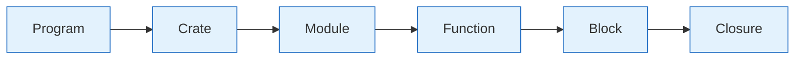
<div align="center">
Figure
</div>
Concepts:
- Global
- Static
- Const
- Module
- Function scope
- Block scope
- Closure capture

Question:
"Where is this name valid?"

---

## 8. LIFETIME

How long can this exist?

Local:
```rust
{
   let x = 1;
}
fn foo<'a>() -> &'a T
&'static T
```

Concepts:

- Lifetime
- Borrow validity
- Scope duration
- Drop timing

Question:

"How long is this relationship valid?"

---

## 9. DATA SHAPE

What kind of thing is flowing?

Primitive:
```rust
i32
bool
```

Owned:
```rust
String
Vec<T>
```

Composite:
```rust
struct
enum
tuple
```

Container:
```rust
Box<T>
Rc<T>
Arc<T>
```

Question:

"What rules apply because of this type?"

---

## 10. SPECIAL BOUNDARIES

Where normal reasoning breaks.

Unsafe:
- raw pointer
- FFI
- union
Async:
- state machines
- Pin
Drop:
- destructor effects
MaybeUninit:
- allocation without value
Cycles:
- Rc graphs
Question:
"What hidden behavior exists?"

---

## FINAL MODEL

A subject can be described as:

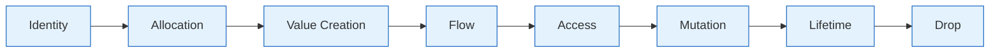
<div align="center">
Figure
</div>

Cross-cutting constraints:
Scope
Data Type
Ownership Model
Unsafe Boundaries

## Mermaid Ownership Color System

Purple:
- Ownership
- Authority
- Source of truth
- Allocation owner

Blue:
- Binding
- Identifier
- Variable name
- Local handle

Orange:
- Access path
- Reference
- Pointer
- Borrow
- Arc/Rc handle
- Indirection

Green:
- Value / Memory
- Actual data
- Heap allocation
- Produced result

Red:
- Mutation
- Unsafe boundary
- Invalidated state
- Exclusive access

Gray:
- Metadata
- Scope
- Compiler concept
- Annotation

**Centering**
For actual centering, Mermaid itself usually inherits the markdown renderer's .mermaid CSS. In Obsidian you can add a CSS snippet: